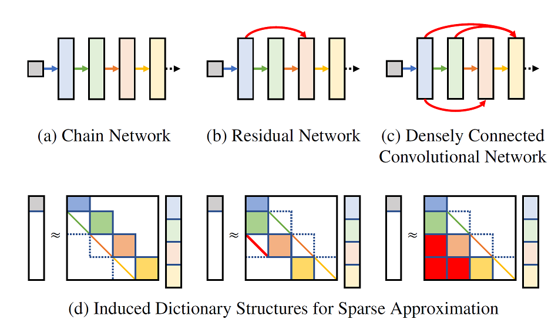
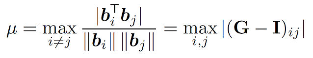
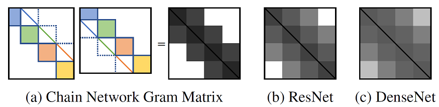
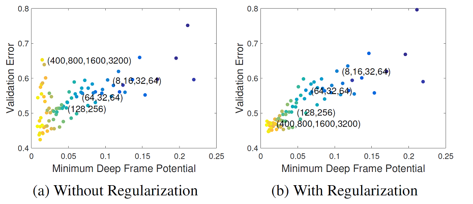
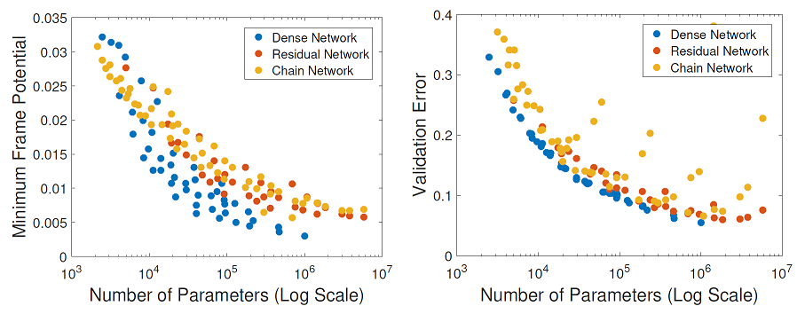

# Dataless Model Selection with the Deep Frame Potential

## Abstract

Choosing a deep neural network architecture is a fundamental problem in applications that require balancing performance and parameter efficiency. Standard approaches rely on ad-hoc engineering or computationally expensive validation on a specific dataset. We instead attempt to quantify networks by their intrinsic capacity for unique and robust representations, enabling efficient architecture comparisons without requiring any data. Building upon theoretical connections between deep learning and sparse approximation, we propose the deep frame potential: a measure of coherence that is approximately related to representation stability but has minimizers that depend only on network structure. This provides a framework for jointly quantifying the contributions of architectural hyper-parameters such as depth, width, and skip connections. We validate its use as a criterion for model selection and demonstrate correlation with generalization error on a variety of common residual and densely connected network architectures.

## Paper

[arXiv](https://arxiv.org/abs/2003.13866)

## Overview

*Why do some deep neural networks work better than others?*

Deep learning has dominated nearly every benchmark within the field of computer vision and has become an integral component in numerous applications ranging from image recognition to self-driving cars. Despite this, the underlying architectures used to learn effective image representations are generally consistent across all of them. From AlexNet [1] to ResNets [2] and DenseNets [3], ad-hoc engineering and extensive experimental validation have led to significant improvements in performance. However, the lack of a theoretical foundation for characterizing generalization capacity has made model selection difficult. 

Building upon recent connections between deep learning and sparse approximation [4, 5], we instead interpret feed-forward deep networks with ReLU activation functions [1] as algorithms for approximate inference in related nonnegative sparse coding problems.

The figure above visualizes this approximate relationship between deep networks and sparse coding. In comparison to (a) sequential chain connections, the skip connections in (b) ResNets and (c) DenseNets induce sparse coding problems with (d) different dictionary structures. We propose to compare deep network architectures indirectly through these structures.

## Method

Using results from sparse approximation theory, we quantify and compare the capacities of induced dictionary structures for achieving low mutual coherence μ, which is theoretically tied to the uniqueness and robustness of sparse representations.

Mutual coherence, as computed above, measures the maximum magnitude normalized inner product between all pairs of columns in a sparse coding dictionary **B**. This is equivalent to the maximum magnitude off-diagonal element in the Gram matrix **G**. Mutual coherence is minimized when the dictionary is close to orthogonal. The minimum attainable mutual coherence depends only on the size of the dictionary and the structure of nonzeros in the Gram matrix.

The figure above shows the Gram matrix structures induced by (a) chain networks, (b) ResNets, and (c) DenseNets. Because denser skip connections result in denser Gram matrices with more nonzero elements, they give lower minimum mutual coherence. Thus, we propose to use a tight lower bound of this value as a data-independent cue for model selection. We derive a theoretical lower bound in the case of chain networks and propose the deep frame potential as a minimization objective function for more general network architectures with skip connections.

## Results

Experimentally, we demonstrate correlation between minimum deep frame potential and validation error on the CIFAR-10 dataset across a wide variety of fully-connected, convolutional, chain, residual, and densely connected network architectures. Furthermore, we show that networks with skip connections can have lower deep frame potentials with fewer learnable parameters, which is predictive of the parameter efficiency of trained networks. 

In the figure above, we compare fully-connected deep network architectures with varying depths and widths with colors indicating parameter count. (a) Some very large networks cannot be trained effectively resulting in unusually high validation errors. (b) This can be remedied through deep frame potential regularization, resulting in high correlation between minimum frame potential and validation error.

In the figure above, we compare parameter efficiency for chain networks, ResNets, and DenseNets. Deep networks that have lower minimum deep frame potential also tend to give lower validation with fewer parameters. This correlation suggests a promising direction of future research towards principled architecture design and model selection through connections between deep learning and sparse approximation theory. 

### Acknowledgments

This work was supported by the CMU Argo AI Center for Autonomous Vehicle Research and by the National Science Foundation under Grant No.1925281.

### References 

[1] Alex Krizhevsky, Ilya Sutskever, and Geoffrey E. Hinton. "Imagenet classification with deep convolutional neural networks." Advances in Neural Information Processing Systems (NeurIPS), 2012.

[2] Karen Simonyan and Andrew Zisserman. "Very deep convolutional networks for large-scale image recognition." International Conference on Learning Representations (ICLR), 2015.

[3] Gao Huang, Zhuang Liu, Kilian Weinberger, and Laurens van der Maaten. "Densely connected convolutional networks." Conference on Computer Vision and Pattern Recognition (CVPR), 2017.

[4] Vardan Papyan, Yaniv Romano, and Michael Elad. "Convolutional neural networks analyzed via convolutional sparse coding." Journal of Machine Learning Research (JMLR), 18(83), 2017.

[5] Calvin Murdock, Ming-Fang Chang, and Simon Lucey. "Deep component analysis via alternating direction neural networks." European Conference on Computer Vision (ECCV), 2018.
